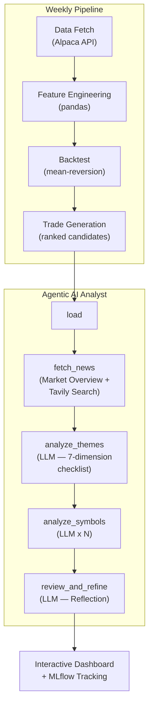
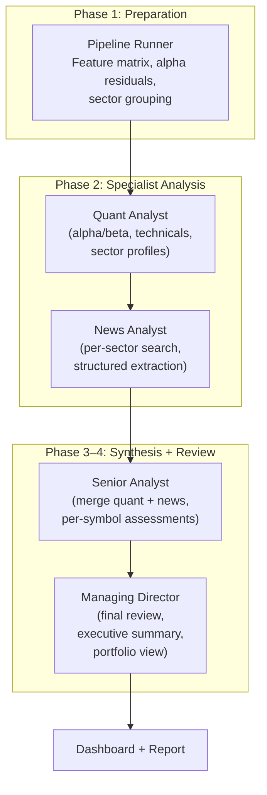

# ETF Weekly Trading System with Multi-Agent AI Analyst

## MVP R&D Workbench — For Research and Educational Purposes Only

> **Disclaimer:** This software is provided for research and educational purposes only.
> It is not financial advice and should not be used for live trading without independent
> verification. Past backtest performance does not guarantee future results. The authors
> assume no liability for any financial losses incurred through the use of this system.

---

### A Note on Independent Discovery

We embarked on this project to combine the best of quantitative and qualitative
approaches to ETF trading — building a multi-agent architecture where specialized
analysts (Quant, News, Synthesis, Review) collaborate to assess trade candidates.
During a literature review conducted in February 2026, we discovered that researchers
at Stony Brook University, Carnegie Mellon, UBC, Yale, and Fudan University had
independently arrived at a strikingly similar architecture:

> **QuantAgent: Price-Driven Multi-Agent LLMs for High-Frequency Trading**
> Fei Xiong, Xiang Zhang, Aosong Feng, Siqi Sun, Chenyu You
> arXiv:2509.09995v3 [cs.CE], September 2025
> [Paper](https://arxiv.org/abs/2509.09995) |
> [GitHub](https://github.com/Y-Research-SBU/QuantAgent) |
> [Website](https://Y-Research-SBU.github.io/QuantAgent/)

QuantAgent decomposes trading into four specialized agents — Indicator, Pattern,
Trend, and Risk — each with domain-specific tools and structured reasoning. While
their focus is high-frequency trading and ours is weekly mean-reversion, the core
insight is the same: **decomposing financial analysis into specialist agents with
distinct tools produces more grounded, traceable, and consistent results than
monolithic LLM approaches.**

We take encouragement from this convergence. It suggests the architectural pattern
is sound, and we applaud the thoroughness of their study — particularly their
rigorous evaluation across nine instruments and multiple time horizons.

---

## What This Project Does

Each week, the system:

1. **Fetches** daily market data for ~2,200 ETFs (Alpaca API)
2. **Engineers** features — returns, volatility, momentum, Bollinger Bands, cyclical encodings
3. **Backtests** a mean-reversion strategy to validate parameters
4. **Generates** ranked trade candidates with entry/exit prices and position sizes
5. **Runs an AI analyst** that searches financial news, computes quantitative profiles, and produces qualitative assessments (GREEN / YELLOW / RED flags)
6. **Produces** an interactive HTML dashboard combining quantitative and qualitative signals

The entire pipeline runs via a single script (`scripts/weekly_update.sh`) and completes in ~10 minutes.

---

## Architecture

### Current (v0.1) — Single-Agent Sequential



### Planned (v0.2) — Multi-Agent Specialist Architecture



See [`docs/V0.2_MULTI_AGENT_DESIGN.md`](docs/V0.2_MULTI_AGENT_DESIGN.md) for the full design.

---

## Agentic AI — The Interesting Part

The analyst (`src/analyst/`) implements a **LangGraph workflow** with the **Reflection Pattern**:

| Node | What It Does | Tool / Model |
|------|-------------|-------------|
| `load` | Initialize state | — |
| `fetch_news` | Market overview + per-symbol news search | Tavily API |
| `analyze_themes` | Identify macro themes using 7-dimension analytical framework | LLM (GPT-4o) |
| `analyze_symbols` | Per-symbol assessment with evidence quality guard | LLM (GPT-4o-mini) |
| `review_and_refine` | **Reflection** — senior analyst reviews, adjusts flags, spots blind spots | LLM (GPT-4o) |

**Key design choices:**

- **Structured Analysis Framework**: Every analysis evaluates 7 dimensions — Technical, Rates/Yield Curve, Credit/Fundamentals, Regulatory/Legal, Macro/Geopolitical, Sector Rotation, and Market-Wide Events
- **Evidence Quality Guard**: Each assessment includes an `evidence_quality` rating (`strong/moderate/weak/none`). When evidence is absent, the system says so rather than fabricating a narrative
- **Market Context Injection**: Broad market overview articles are fetched first and injected into every per-symbol prompt, ensuring macro context is never missed
- **Multi-Model Routing**: Different LLMs for analysis vs. review (e.g., GPT-4o-mini for bulk, GPT-4o for synthesis and critical review). Configurable via environment variables
- **Reflection Pattern**: The reviewer node critiques the initial analysis, catches inconsistencies, and adjusts conviction flags
- **MLflow Integration**: Every run logs parameters, token usage, costs, flag distributions, and artifacts

### Databricks Deployment

The agent has been ported to a self-contained Databricks notebook (`notebooks/analyst_databricks.py`) with:
- Widget-based API key configuration
- Native MLflow experiment tracking
- `displayHTML()` for interactive reports
- Zero dependencies on the local `src/` package structure

---

## Research Journey

This project evolved through several phases:

1. **Momentum strategies** — classic trend-following with grid search over lookback windows, volume thresholds, and position sizing
2. **ML classification** — scikit-learn, XGBoost, and PyTorch models predicting weekly direction. Explored rolling cross-validation, regime detection, and feature importance
3. **Mean-reversion** — the current strategy. Buy ETFs that dropped significantly (bottom 5%, >2% weekly loss), targeting a 1–3 week bounce. Backtested across ~2,200 symbols with parameter optimization
4. **Agentic AI overlay (v0.1)** — Single-agent LangGraph analyst with news search, thematic analysis, per-symbol assessment, and reflection review
5. **Multi-agent design (v0.2)** — Specialist agents (Quant, News, Synthesis, Review) with alpha/beta decomposition, sector-aware analysis, and epistemic honesty protocols
6. **Literature review** — Discovered convergence with QuantAgent and broader academic work on LLMs in finance. See [`docs/LITERATURE_SEARCH_PROMPT.md`](docs/LITERATURE_SEARCH_PROMPT.md)

The `src/workflow/research/` directory contains 25+ experiment scripts documenting this evolution.
The `docs/` directory contains lessons learned and design documents.

---

## Key Learnings (v0.1)

See [`docs/V0.1_LESSONS_LEARNED.md`](docs/V0.1_LESSONS_LEARNED.md) for the full write-up. Headlines:

1. **LLMs are better at synthesis than discovery** — they organize information you give them, but are poor at finding it and terrible at admitting when they can't
2. **Quantitative grounding is essential** — without alpha/beta decomposition, the LLM invents ETF-specific narratives for market-wide movements
3. **Sector is the right unit of analysis** for news, not individual ETFs
4. **Evidence quality matters more than analysis quality** — "no specific evidence found" is more useful than a fluent but ungrounded narrative
5. **The LLM's highest-value role is risk avoidance** — filtering out "falling knives" (structural declines), not finding better trades

---

## Project Structure

```
trading_etf/
├── scripts/
│   └── weekly_update.sh            # One-command weekly pipeline
├── src/
│   ├── analyst/                     # Agentic AI analyst
│   │   ├── graph.py                #   LangGraph workflow (5 nodes)
│   │   ├── run.py                  #   CLI entry point + MLflow logging
│   │   ├── instrumentation.py      #   Detailed metrics (tokens, cost, latency)
│   │   ├── logging_config.py       #   Trace logging (full prompts/responses)
│   │   └── tools/
│   │       └── search.py           #   Tavily web search + market overview
│   ├── data/                        # Data sources, ETL, feature engineering
│   │   ├── alpaca_source.py        #   Alpaca Markets API integration
│   │   ├── market_data_source.py
│   │   ├── weekly_feature_engineering.py
│   │   ├── etf_filter.py
│   │   ├── symbol_filter.py
│   │   ├── symbol_list_manager.py
│   │   ├── metadata_manager.py
│   │   └── data_source_factory.py
│   ├── backtesting/                 # Strategy backtesting engine
│   │   ├── mean_reversion_backtester.py
│   │   ├── portfolio_backtester.py
│   │   └── experiment_runner.py
│   ├── strategies/                  # Trading strategies
│   │   ├── base_strategy.py
│   │   ├── momentum_strategy.py
│   │   └── strategy_factory.py
│   ├── models/                      # ML model registry
│   ├── training/                    # ML model training (sklearn, XGBoost, PyTorch)
│   │   ├── cross_validator.py
│   │   ├── data_loader.py
│   │   ├── feature_builder.py
│   │   ├── evaluator.py
│   │   ├── model_factory.py
│   │   ├── normalizer.py
│   │   ├── prediction_analyzer.py
│   │   ├── visualizer.py
│   │   └── models/                 #   Linear, tree, classification models
│   ├── reports/                     # Generated weekly retrospectives
│   ├── utils/                       # Date utilities, device detection
│   ├── visualization/               # Plotly-based visualizations
│   └── workflow/
│       ├── config.py                # Shared configuration
│       ├── workflow_utils.py        # Shared utilities
│       ├── pipeline/                # Production scripts (00–05, 21a–21b)
│       └── research/               # Research scripts (06–22)
├── notebooks/
│   ├── analyst_databricks.py       # Databricks notebook (self-contained)
│   ├── analyst_databricks_confirmed.py  # Validated on Databricks
│   ├── test_local.py               # Local validation runner
│   └── sample_candidates.csv       # Sample data for testing
├── docs/
│   ├── V0.1_LESSONS_LEARNED.md     # What worked, what didn't
│   ├── V0.2_MULTI_AGENT_DESIGN.md  # Clean-sheet multi-agent architecture
│   ├── LITERATURE_SEARCH_PROMPT.md # Prompt for academic/industry survey
│   ├── FEATURES.md                 # Feature documentation
│   └── WEEKLY_UPDATE.md            # Weekly pipeline guide
├── pyproject.toml                   # Package configuration
├── setup.py
├── requirements.txt
├── RESEARCH_LOG.md                  # Research journey narrative
├── CODING_STANDARDS.md
└── SETUP.md
```

Note: The pipeline generates `data/`, `experiments/`, `pre_production/`, and `logs/` at runtime — these are gitignored and reproducible by rerunning the workflow.

---

## Quick Start

### Prerequisites

- Python 3.11+
- API keys: [Alpaca](https://alpaca.markets/) (market data), [Tavily](https://tavily.com/) (news search), and one of: [Google AI](https://ai.google.dev/) (Gemini) or [OpenAI](https://platform.openai.com/) (GPT)

### Setup

```bash
git clone https://github.com/kgrajski/trading_etf.git
cd trading_etf

python -m venv .venv
source .venv/bin/activate
pip install -r requirements.txt
```

Create a `.env` file:

```
APCA_API_KEY_ID=your_alpaca_key
APCA_API_SECRET_KEY=your_alpaca_secret
APCA_API_BASE_URL=https://paper-api.alpaca.markets

TAVILY_API_KEY=your_tavily_key
GOOGLE_API_KEY=your_google_key
ANALYST_LLM_MODEL=gemini-2.0-flash
```

### Run the Weekly Pipeline

```bash
bash scripts/weekly_update.sh
```

### Run Just the Analyst

```bash
python -m src.analyst.run path/to/candidates.csv
```

Output (JSON report, HTML report, graph visualization) is saved alongside the input CSV.

### View MLflow Results

```bash
mlflow ui --port 5000
# Open http://127.0.0.1:5000
```

---

## Technologies

| Layer | Technologies |
|-------|-------------|
| **Data** | Alpaca Markets API, pandas, NumPy |
| **Strategy** | Custom mean-reversion backtester, scipy |
| **ML** | scikit-learn, XGBoost, PyTorch |
| **Agentic AI** | LangGraph, LangChain, Tavily Search |
| **LLMs** | Gemini 2.0 Flash, GPT-4o, GPT-4o-mini, Claude 3.5 Sonnet (multi-model routing) |
| **Tracking** | MLflow (local + Databricks) |
| **Visualization** | Plotly, custom HTML dashboards |
| **Deployment** | Databricks notebooks, DBFS |
| **Infrastructure** | Python 3.11, dotenv, shell pipeline |

---

## Related Work

- [QuantAgent](https://arxiv.org/abs/2509.09995) — Multi-agent LLM framework for HFT (Xiong et al., 2025)
- [FinGPT](https://arxiv.org/abs/2306.06031) — Open-source financial LLMs (Yang et al., 2023)
- [BloombergGPT](https://arxiv.org/abs/2303.17564) — Domain-specific financial LLM (Wu et al., 2023)
- [FinBERT](https://arxiv.org/abs/1908.10063) — Financial sentiment analysis baseline (Araci, 2019)

## License

MIT
